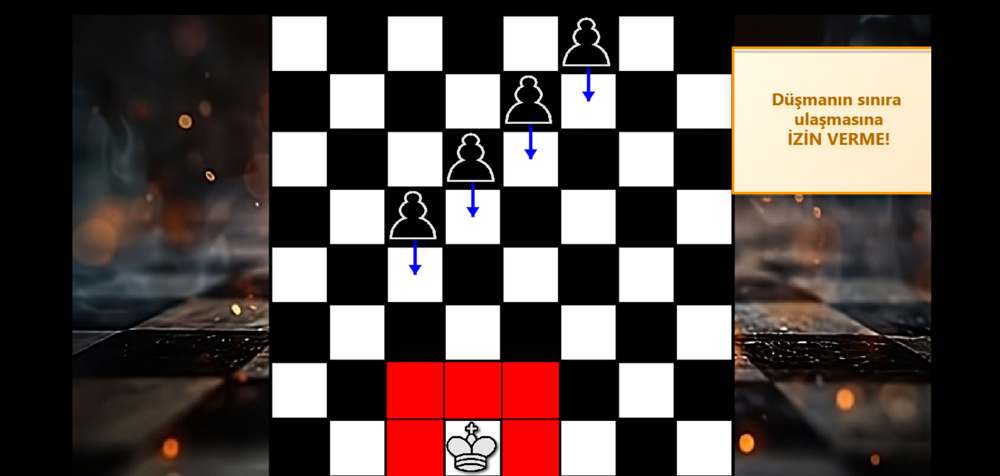
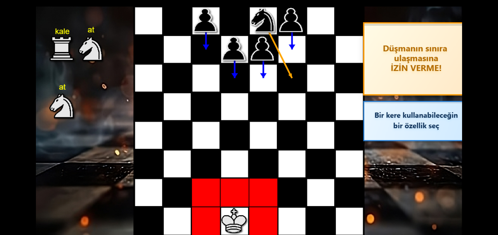
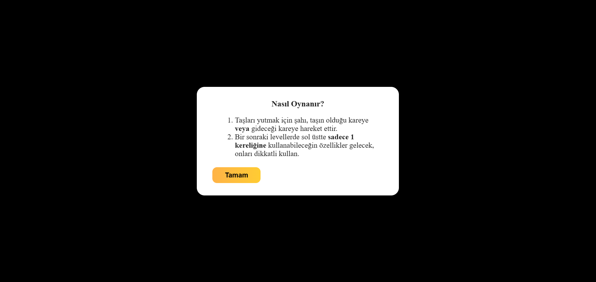
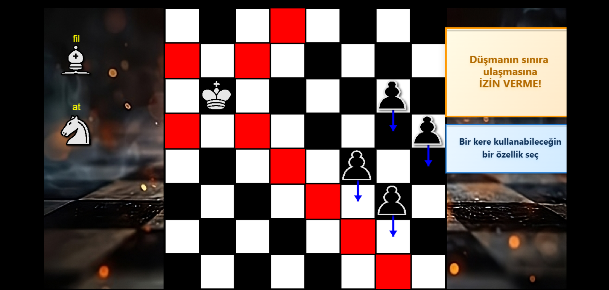

# ♟️ Last-piece-standing
Last Piece Standing, HTML5, Canvas ve JavaScript kullanılarak geliştirilen , klasik satranç taşlarının yeteneklerinden ilham alan, seviye tabanlı ve stratejik bir oyunudur. Oyuncu, şah karakterini kullanarak gelen düşman taşlarını alt etmeye çalışır. Amaç: En sona kalan tek taş olmak!

# 🎮 Nasıl Oynanır
 [Oyunu oynamak için tıklayabilirsiniz](https://samierz.github.io/Last-Piece-Standing/) 

 [Oyunun oynanış videosuna ulaşmak için tıklayabilirsiniz](https://youtu.be/o3tGT5dbmac)
 
   
 
 - Oyunda amaç kontrol ettiğiniz şah karakteri ile bütün taşları yutmak
 - Taşları İki şekilde yutabilirsiniz
     - Yutulacak taşın o anda olduğu kareye tıklayarak
     - Yutulacak taşın gideceği kareye(okun gösterdiği) kareye tıklayarak
 - Bütün taşları yuttuğunuz zaman bi sonraki levele geçer
 - İlk ve son level hariç bütün levellerde sol üstte sadece 1 kez kullanabileceğiniz özellikler çıkar.
 - Bu özellikler satrancın diğer taşlarıdır
 - Taşlardan birine tıkladığınız zaman o taş gibi şah taşını hareket ettirebilirsiniz.
   
   
   Mesela Burda sol üstteki fil taşına tıklanmış

# 📋 Seviyeler ve Dinamikler
- Oyun toplam 7 seviye içerir.
- Her seviyede farklı düşman türleri gelir: piyonlar, atlar, filler ve son olarak düşman şah.
- Seviyeler arasında geçiş animasyonları, mesaj kutuları ve özellik gibi detaylar mevcuttur.
- Oyuncu her seviyede seçtiği özel taşı sadece bir kez kullanabilir.
- Son seviyede düşman şah gelir. Eğer oyuncu onu da yok ederse oyun kazanılır.

# ✨ Özellikler

**7 Farklı Seviye:**
Oyuncuyu giderek zorlaşan düşman taş kombinasyonlarıyla karşılayan yedi seviye. Her seviye yeni taş türleri ve strateji gereksinimleri sunar.

**Stratejik Yardımcı Taş Seçimi:**
Oyuncu o seviyede çıkan özel taşları seçebilir. Bu taşların yetenekleri (kale, at, fil gibi) yalnızca bir kez kullanılır ve seçimler sonucu etkiler.

**Gerçekçi Taş Hareketi:**
Satranç taşlarının klasik hareket kuralları (örneğin, atın L şeklinde gitmesi, kalenin düz gitmesi) sadık biçimde uygulanır.

**Ses Efektleri:**
Taş hareketi, taş yeme ve arka plan müziği gibi olaylar ses efektleriyle desteklenir.

**Seviye Geçiş Sistemi ve Son Görev:**
Her seviyeden sonra açıklayıcı yönlendirmeler ve metin kutuları gösterilir. 7. seviyede düşman şah geldiğinde final mücadelesi başlar.

**Sınır Kontrollü Kaybetme Mekaniği:**
Düşman taşlarından biri sınır çizgisine ulaşırsa, seviye sıfırlanır. Oyuncunun sürekli tehdit altında kalması sağlanır.

**Modüler Harita Sistemi:**
Tahta yapısı ve taş yerleşimleri kolayca değiştirilebilecek yapıdadır. Geliştirici için genişletilebilir bir tasarım sunar.

**Klavye ve Fare Desteği:**
Tüm oyun fare ile oynanır. Oyuncu taşını tıklayıp hamlesini planlayabilir. Bazı özel durumlarda klavye yön tuşları da desteklenebilir.

# İlham Alınan Oyun
 [İlham alınan oyuna ulaşmak için tıklayabilirsiniz](https://sandroleon.itch.io/the-last-piece-standing) 

  
